# Bitcoin Blockchain 

## Bitcoin Core

#### Syncing
  <p align="center">
  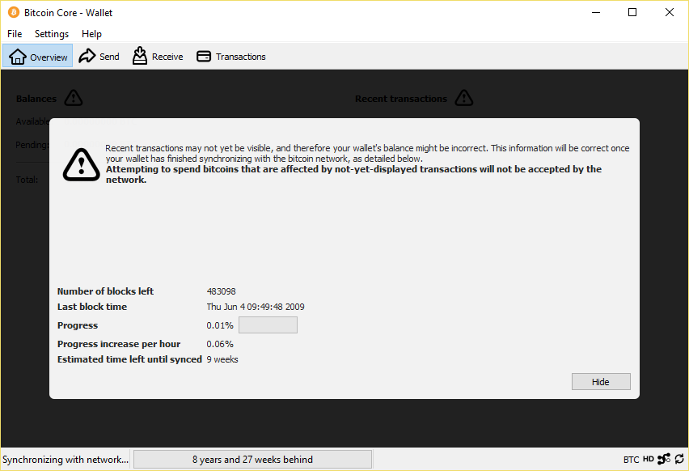
  </p>
  
#### Bitcoin Folder Strucutre
  <p align="center">
  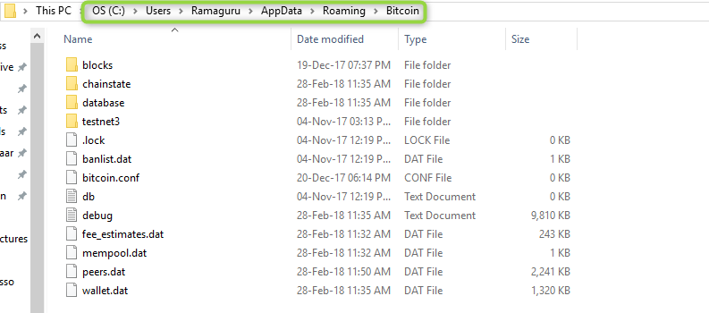
  </p>
  
#### Bitcoin blocks Folder Strucutre
  <p align="center">
  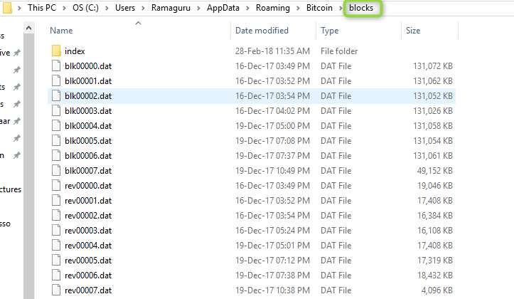
  </p>
  
#### Bitcoin Block Header Format
  <p align="center">
  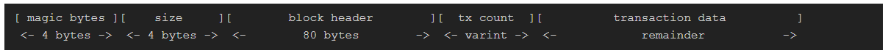
  </p>  
  
#### Block.DAT File Analysis
  <p align="center">
  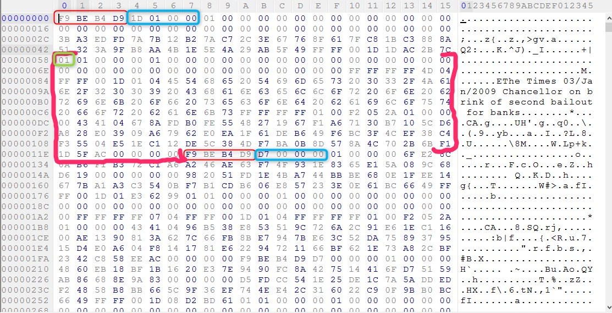
  </p>  
  
## Bitcoin Block Explorer

```
python BitcoinBlockExplorer.py C:\Users\<username>\AppData\Roaming\Bitcoin\blocks
```

#### CSV File
  <p align="center">
  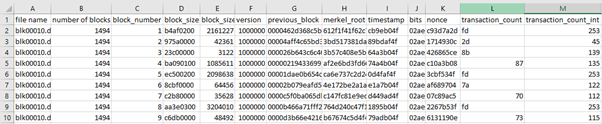
  </p>
  
[Click Here to view the file](https://amrita-tifac-cyber-blockchain.github.io/Blockchain-and-Cryptocurrency-Forensics/Blockchain/Bitcoin/BitcoinBlockExplorer_Results/BC_1621090905/CD_1.csv)  
  
#### Log File
  <p align="center">
  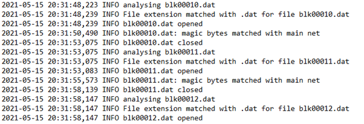
  </p>
  
[Click Here to view the file](https://amrita-tifac-cyber-blockchain.github.io/Blockchain-and-Cryptocurrency-Forensics/Blockchain/Bitcoin/BitcoinBlockExplorer_Results/BC_1621090905/bitlyse.log)  

#### Time Log File
  <p align="center">
  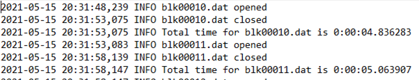
  </p>
  
[Click Here to view the file](https://amrita-tifac-cyber-blockchain.github.io/Blockchain-and-Cryptocurrency-Forensics/Blockchain/Bitcoin/BitcoinBlockExplorer_Results/BC_1621090905/time.log)    

## Bitcoin API Caller

```
python BitcoinAPICaller.py
```

#### Supported APIs
  <p align="center">
  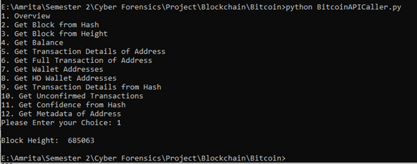
  </p>

#### Unconfirmed Transactions API
  <p align="center">
  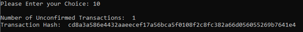
  </p>
  
#### Confidence Score API
  <p align="center">
  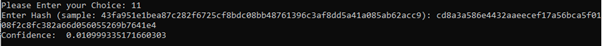
  </p>

### Credits
- _Ramaguru R_
- _Anuhya Gandavaram_
