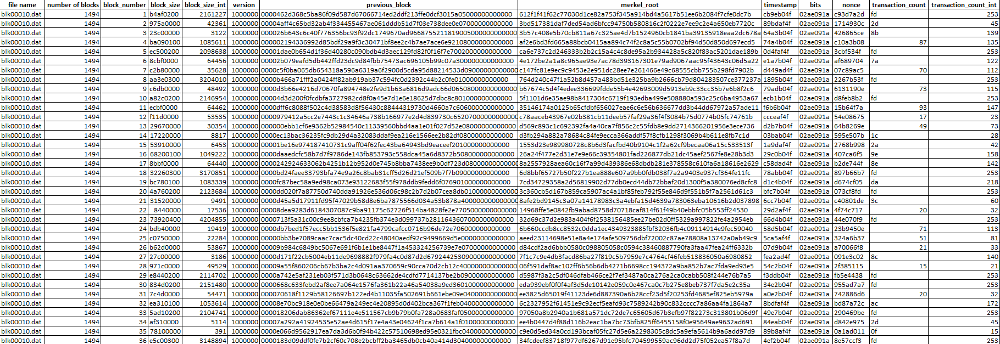

# Bitcoin Blockchain 

## Bitcoin Block Explorer

```
python BitcoinBlockExplorer.py C:\Users\<username>\AppData\Roaming\Bitcoin\blocks
```

#### CSV File
  <p align="center">
  
  </p>
  
#### Log File
  <p align="center">
  
  </p>

#### Time Log File
  <p align="center">
  
  </p>

## Bitcoin API Caller

```
python BitcoinAPICaller.py
```

#### Supported APIs
  <p align="center">
  
  </p>

#### Unconfirmed Transactions API
  <p align="center">
  
  </p>
  
#### Confidence Score API
  <p align="center">
  
  </p>

### Credits

- _Anuhya Gandavaram_
