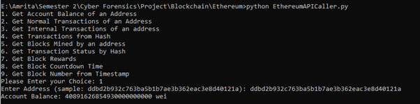
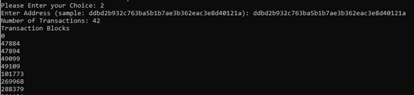
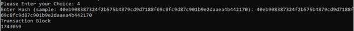

# Ethereum Blockchain 

## Ethereum API Caller

```
python EthereumAPICaller.py 
```

#### Supported APIs
  <p align="center">
  
  </p>

#### Normal Transactions  of an Address API
  <p align="center">
  
  </p>
  
#### Transactions from Hash API
  <p align="center">
  
  </p>

### Credits

- _Anuhya Gandavaram_
