# Blockchain Forensics using Graph Temporal Logic 
      

## Huobi Case Study Results

Bitcoin Address : **1HckjUpRGcrrRAtFaaCAUaGjsPx9oYmLaZ**

### OSINT

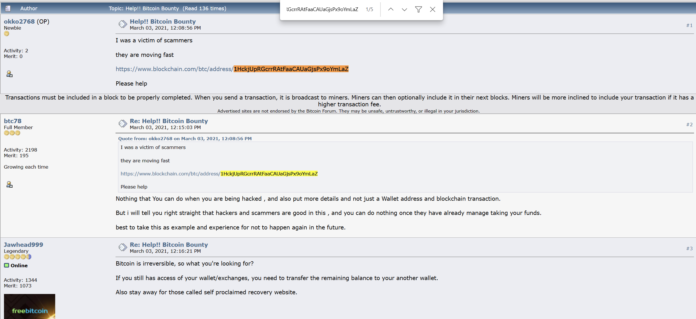

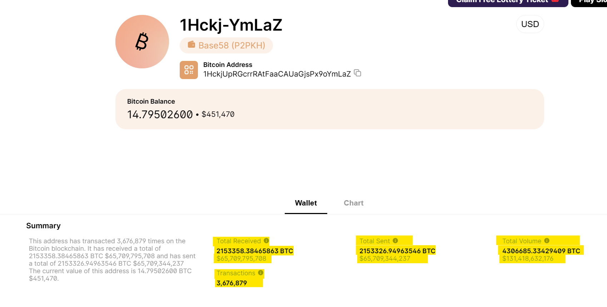

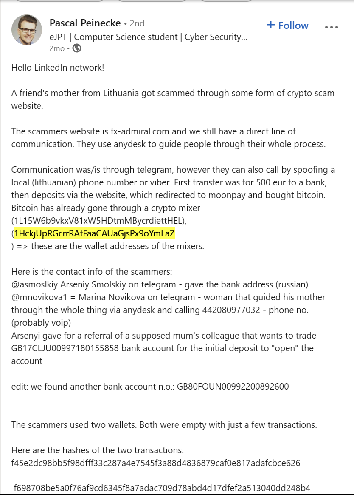

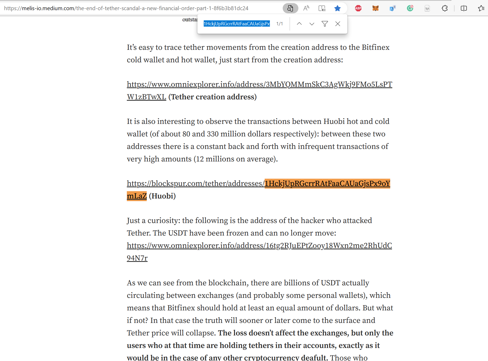

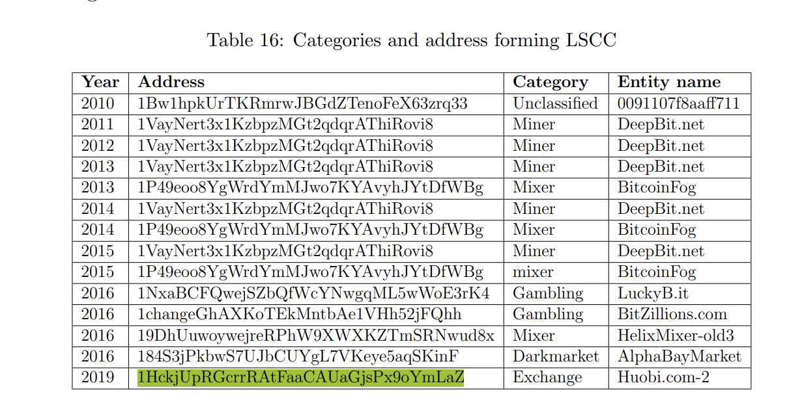

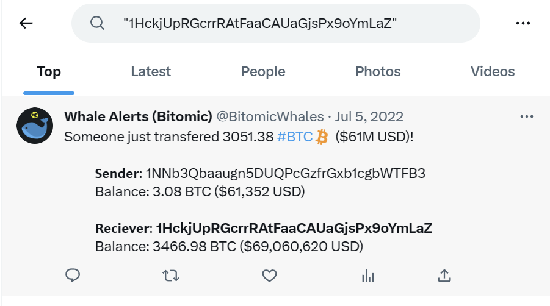

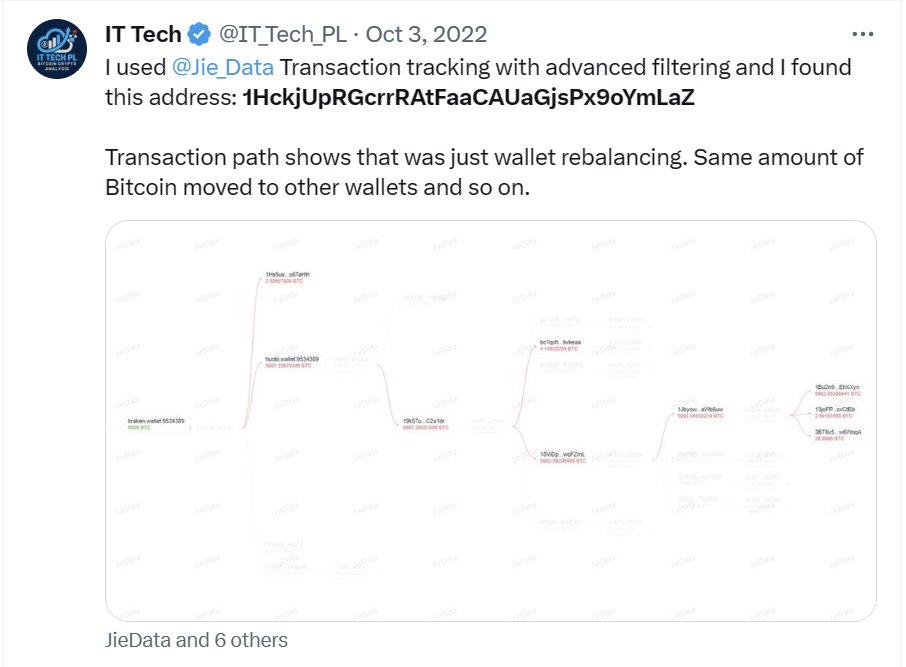

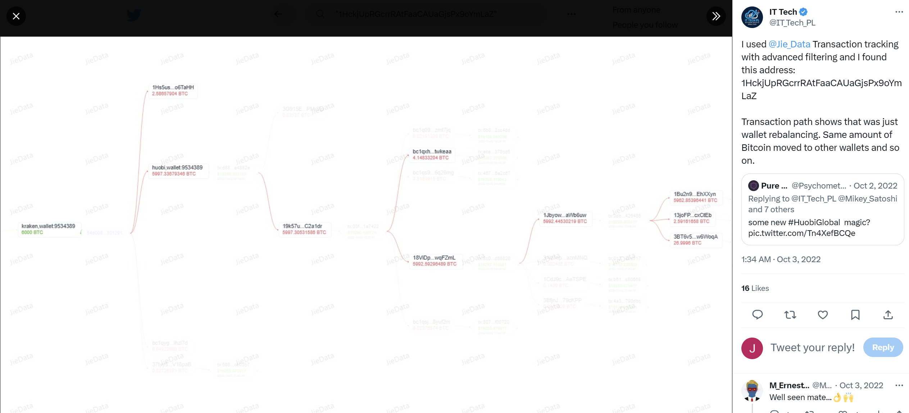

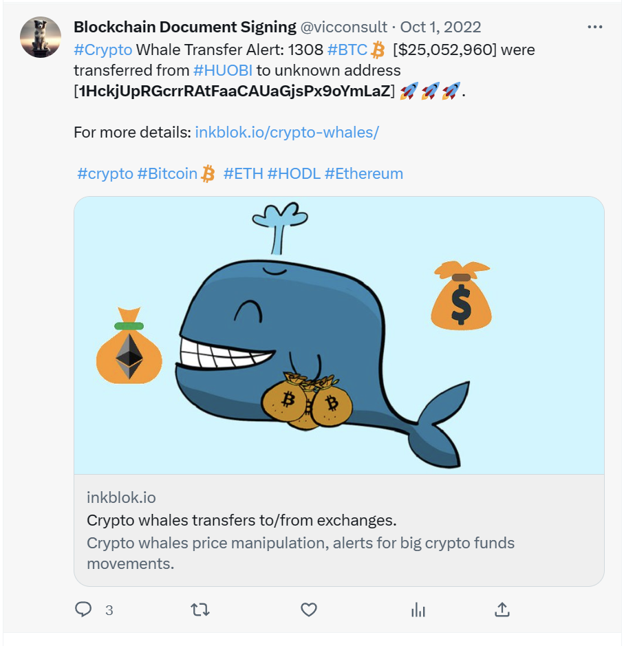

### Temporal Graph Visualization

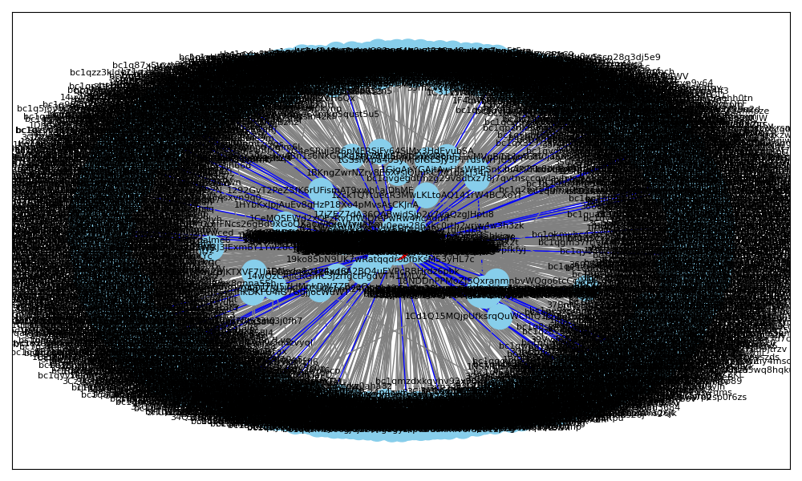

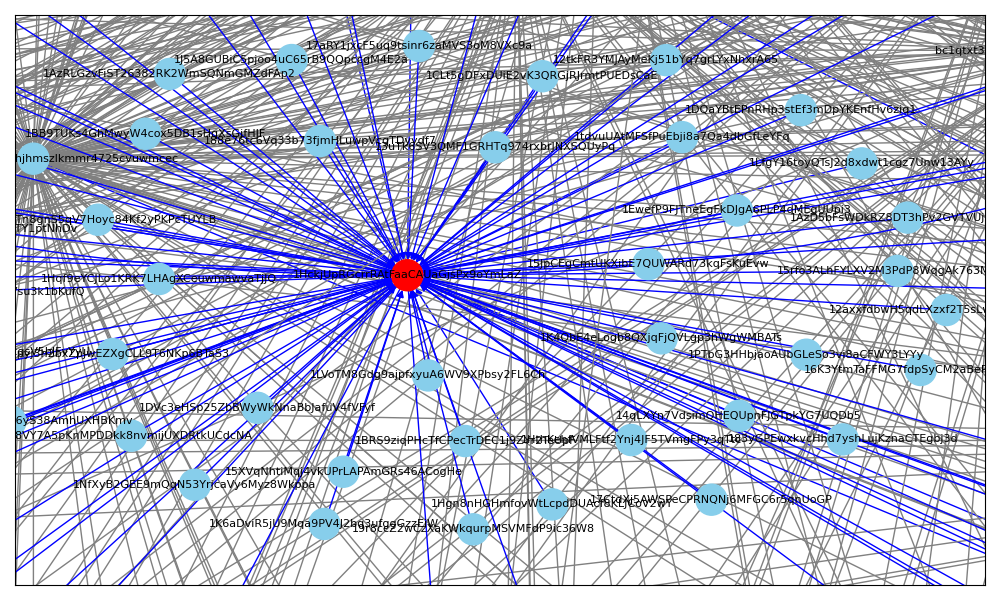

### Reference
- Pranav Nerurkar, Dhiren Patel, Yann Busnel, Romaric Ludinard, Saru Kumari, et al.. Dissecting bitcoin blockchain: Empirical Analysis of Bitcoin network (2009-2020). Journal of Network and Computer Applications (JNCA), 2021, 177, pp.102940. ff10.1016/j.jnca.2020.102940ff. ffhal-03030340
