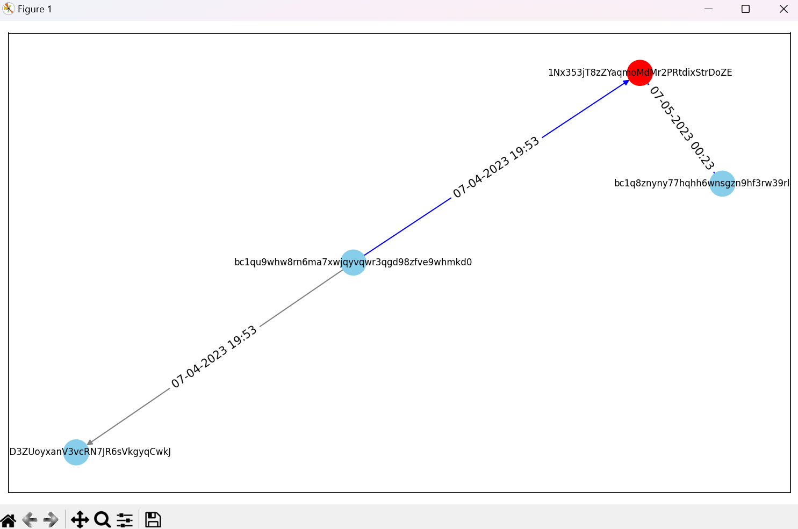

# Blockchain Forensics using Graph Temporal Logic 
     <br/>


## Visualization with Different Cryptocurrency with Timestamp
### Code
```
import requests
import pandas as pd
import networkx as nx
import matplotlib.pyplot as plt
from datetime import datetime

def fetch_address_data(address, address_type):
    """
    Function to fetch address data from different blockchain APIs based on the address type.

    Parameters:
    - address (str): The address for which data needs to be fetched.
    - address_type (str): The type of address (bitcoin, ethereum, tron, solana, litecoin, cardano).

    Returns:
    - data (dict): The fetched address data in JSON format.
    """

    if address_type == "bitcoin":
        url = f"https://blockchain.info/address/{address}?format=json"
    elif address_type == "ethereum":
        url = f"https://api.blockchain.com/eth/v1/address/{address}/transactions"
    elif address_type == "tron":
        url = f"https://blockchain.info/tron/address/{address}?format=json"
    elif address_type == "solana":
        url = f"https://blockchain.info/sol/address/{address}?format=json"
    elif address_type == "litecoin":
        url = f"https://blockchain.info/ltc/address/{address}?format=json"
    elif address_type == "cardano":
        url = f"https://blockchain.info/ada/address/{address}?format=json"
    else:
        raise ValueError("Invalid address type")

    response = requests.get(url)
    data = response.json()
    return data


def transform_data(data, address_type):
    """
    Function to transform the fetched address data into a standardized format.

    Parameters:
    - data (dict): The fetched address data in JSON format.
    - address_type (str): The type of address (bitcoin, ethereum, tron, solana, litecoin, cardano).

    Returns:
    - transactions (list): The transformed address data as a list of dictionaries.
    """

    transactions = []

    if address_type == "bitcoin":
        for tx in data["txs"]:
            if "inputs" in tx and "prev_out" in tx["inputs"][0] and "addr" in tx["inputs"][0]["prev_out"]:
                address_a = tx["inputs"][0]["prev_out"]["addr"]
            else:
                address_a = None
            
            for out in tx["out"]:
                if "addr" in out:
                    address_b = out["addr"]
                    timestamp = datetime.fromtimestamp(tx["time"]).strftime("%m-%d-%Y %H:%M")
                    transaction_id = tx["hash"]
                    transaction = {
                        "Address A": address_a,
                        "Address B": address_b,
                        "Timestamp": timestamp,
                        "Transaction ID": transaction_id
                    }
                    transactions.append(transaction)
    else:
        for tx in data["txs"]:
            address_a = tx.get("inputs", [{}])[0].get("prev_out", {}).get("addr", None)
            for out in tx.get("out", []):
                address_b = out.get("addr", None)
                timestamp = datetime.fromtimestamp(tx.get("time", 0)).strftime("%m-%d-%Y %H:%M")
                transaction_id = tx.get("hash", "")
                transaction = {
                    "Address A": address_a,
                    "Address B": address_b,
                    "Timestamp": timestamp,
                    "Transaction ID": transaction_id
                }
                transactions.append(transaction)

    return transactions


def export_to_excel(data, filename):
    """
    Function to export data to an Excel file.

    Parameters:
    - data (list): The data to be exported as a```python
    - data (list): The data to be exported as a list of dictionaries.
    - filename (str): The filename of the Excel file.
    """

    df = pd.DataFrame(data)
    df.to_excel(filename, index=False)
    print(f"Data exported to {filename}")


def create_and_visualize_graph(df, user_addresses):
    """
    Function to create a graph from the transformed data and visualize it.

    Parameters:
    - df (DataFrame): The transformed address data as a pandas DataFrame.
    - user_addresses (list): The list of user addresses.

    Returns:
    - None
    """

    # Create a networkx graph
    graph = nx.DiGraph()

    # Add nodes to the graph
    for address in df['Address A'].unique():
        if address in user_addresses:  # Highlight user address nodes in red
            graph.add_node(address, color='red')
        else:
            graph.add_node(address, color='skyblue')

    # Add edges with attributes to the graph
    for _, row in df.iterrows():
        source = str(row['Address A'])
        target = str(row['Address B'])
        timestamp = str(row['Timestamp'])
        if source in user_addresses or target in user_addresses:  # Highlight edges connected to user address in blue
            graph.add_edge(source, target, color='blue', timestamp=timestamp)
            if source in user_addresses:
                graph.nodes[source]['color'] = 'red'
            if target in user_addresses:
                graph.nodes[target]['color'] = 'red'
        else:
            graph.add_edge(source, target, color='gray', timestamp=timestamp)

    # Draw the graph using matplotlib
    plt.figure(figsize=(10, 6))
    pos = nx.spring_layout(graph)
    node_colors = [graph.nodes[node].get('color', 'skyblue') for node in graph.nodes]
    edge_colors = [graph.edges[edge]['color'] for edge in graph.edges]
    edge_labels = nx.get_edge_attributes(graph, 'timestamp')  # Get edge attributes for labels

    nx.draw_networkx(graph, pos, with_labels=True, node_size=500, font_size=8, node_color=node_colors, edge_color=edge_colors)
    nx.draw_networkx_edge_labels(graph, pos, edge_labels=edge_labels)  # Draw edge labels

    # Show the graph
    plt.tight_layout()
    plt.show()


def main():
    # Main program
    num_addresses = int(input("Enter the Number of Addresses to Visualize (1-4): "))
    user_addresses = []
    address_types = []

    for i in range(num_addresses):
        address_type = input(f"Enter type of address {i+1} of {num_addresses} (bitcoin, ethereum, tron, solana, litecoin, cardano): ")
        address = input(f"Enter address {i+1} of {num_addresses}: ")
        user_addresses.append(address)
        address_types.append(address_type)

    # Fetch address data for each user address
    all_transformed_data = []
    for address, address_type in zip(user_addresses, address_types):
        address_data = fetch_address_data(address, address_type)
        transformed_data = transform_data(address_data, address_type)
        all_transformed_data.extend(transformed_data)

    # Export all data to a single Excel file
    export_to_excel(all_transformed_data, "Data.xlsx")

    # Read the Excel file
    df = pd.read_excel('Data.xlsx')

    # Create and visualize the graph, passing the user addresses as an argument
    create_and_visualize_graph(df, user_addresses)


if __name__ == "__main__":
    main()
```

### Output
<p align="center">

</p>

### Source
<p align="center">

</p>

