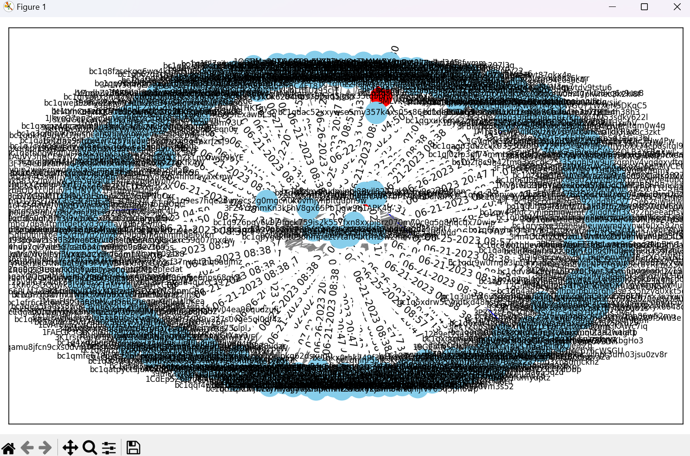

# Blockchain Forensics using Graph Temporal Logic 
     <br/>


## Visualization with Four Address along with Timestamp
### Code
```
import requests
import pandas as pd
import networkx as nx
import matplotlib.pyplot as plt
from datetime import datetime

def fetch_address_data(address):
    """
    Function to fetch address data from the blockchain.info API.

    Args:
        address (str): The Bitcoin address to fetch data for.

    Returns:
        dict: The JSON response containing address data.
    """
    url = f"https://blockchain.info/address/{address}?format=json"
    response = requests.get(url)
    data = response.json()
    return data

def transform_data(data):
    """
    Function to transform address data into a list of transactions.

    Args:
        data (dict): The address data obtained from the API.

    Returns:
        list: A list of transformed transactions.
    """
    transactions = []
    for tx in data["txs"]:
        if "inputs" in tx and "prev_out" in tx["inputs"][0] and "addr" in tx["inputs"][0]["prev_out"]:
            address_a = tx["inputs"][0]["prev_out"]["addr"]
        else:
            address_a = None
        
        for out in tx["out"]:
            if "addr" in out:
                address_b = out["addr"]
                timestamp = datetime.fromtimestamp(tx["time"]).strftime("%m-%d-%Y %H:%M")
                transaction_id = tx["hash"]
                transaction = {
                    "Address A": address_a,
                    "Address B": address_b,
                    "Timestamp": timestamp,
                    "Transaction ID": transaction_id
                }
                transactions.append(transaction)
    return transactions

def export_to_excel(data, filename):
    """
    Function to export data to an Excel file.

    Args:
        data (list): The data to export.
        filename (str): The name of the Excel file.

    Returns:
        None
    """
    df = pd.DataFrame(data)
    df.to_excel(filename, index=False)
    print(f"Data exported to {filename}")

def create_and_visualize_graph(df, user_addresses):
    """
    Function to create a graph from the data and visualize it.

    Args:
        df (pandas.DataFrame): The DataFrame containing transaction data.
        user_addresses (list): List of user addresses to highlight in the graph.

    Returns:
        None
    """
    # Create a networkx graph
    graph = nx.DiGraph()

    # Add nodes to the graph
    for address in df['Address A'].unique():
        if address in user_addresses:  # Highlight user address nodes in red
            graph.add_node(address, color='red')
        else:
            graph.add_node(address, color='skyblue')

    # Add edges with attributes to the graph
    for _, row in df.iterrows():
        source = str(row['Address A'])
        target = str(row['Address B'])
        timestamp = str(row['Timestamp'])
        if source in user_addresses or target in user_addresses:  # Highlight edges connected to user address in blue
            graph.add_edge(source, target, color='blue', timestamp=timestamp)
            if source in user_addresses:
                graph.nodes[source]['color'] = 'red'
            if target in user_addresses:
                graph.nodes[target]['color'] = 'red'
        else:
            graph.add_edge(source, target, color='gray', timestamp=timestamp)

    # Draw the graph using matplotlib
    plt.figure(figsize=(10, 6))
    pos = nx.spring_layout(graph)
    node_colors = [graph.nodes[node].get('color', 'skyblue') for node in graph.nodes]
    edge_colors = [graph.edges[edge]['color'] for edge in graph.edges]
    edge_labels = nx.get_edge_attributes(graph, 'timestamp')  # Get edge attributes for labels

    nx.draw_networkx(graph, pos, with_labels=True, node_size=500, font_size=8, node_color=node_colors, edge_color=edge_colors)
    nx.draw_networkx_edge_labels(graph, pos, edge_labels=edge_labels)  # Draw edge labels

    # Show the graph
    plt.tight_layout()
    plt.show()

# Main program
num_addresses = int(input("Enter the Number of Addresses to Visualize (1-4): "))
user_addresses = []
for i in range(num_addresses):
    address = input(f"Enter address {i+1} of {num_addresses}: ")
    user_addresses.append(address)

# Fetch address data for each user address
all_transformed_data = []
for address in user_addresses:
    address_data = fetch_address_data(address)
    transformed_data = transform_data(address_data)
    all_transformed_data.extend(transformed_data)

# Export all data to a single Excel file
export_to_excel(all_transformed_data, "Data.xlsx")

# Read the Excel file
df = pd.read_excel('Data.xlsx')

# Create and visualize the graph, passing the user addresses as an argument
create_and_visualize_graph(df, user_addresses)

```

### Output
<p align="center">

</p>

<p align="center">

</p>

### Source
<p align="center">

</p>

<p align="center">

</p>

