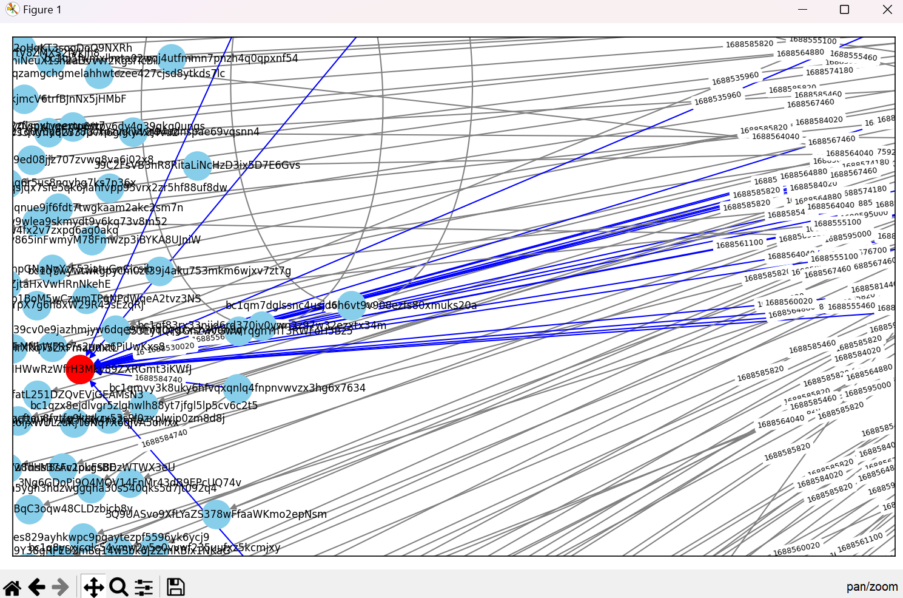

# Blockchain Forensics using Graph Temporal Logic 
     <br/>


## Visualization with UTC
### Code
```
import requests
import pandas as pd
from datetime import datetime
import pathpy as pp
import networkx as nx
import matplotlib.pyplot as plt


def fetch_address_data(address):
    """
    Function to fetch address data.

    :param address: The address to fetch data for.
    :return: The fetched data.
    """
    url = f"https://blockchain.info/address/{address}?format=json"
    response = requests.get(url)
    data = response.json()
    return data


def transform_data(data):
    """
    Function to transform address data.

    :param data: The address data to transform.
    :return: The transformed data.
    """
    transactions = []
    for tx in data["txs"]:
        for out in tx["out"]:
            address_a = tx["inputs"][0]["prev_out"]["addr"]
            address_b = out["addr"]
            timestamp = datetime.fromtimestamp(tx["time"]).strftime("%m-%d-%Y %H:%M")
            transaction_id = tx["hash"]
            transaction = {
                "Address A": address_a,
                "Address B": address_b,
                "Timestamp": timestamp,
                "Transaction ID": transaction_id
            }
            transactions.append(transaction)
    return transactions


def export_to_excel(data):
    """
    Function to export data to Excel.

    :param data: The data to export.
    """
    df = pd.DataFrame(data)
    df["Timestamp"] = pd.to_datetime(df["Timestamp"])  # Convert Timestamp column to datetime
    df["Timestamp"] = df["Timestamp"].dt.strftime("%m-%d-%Y %H:%M")  # Format Timestamp column
    filename = "Data.xlsx"  # Change the filename to "Data.xlsx"
    df.to_excel(filename, index=False)
    print(f"Data exported to {filename}")


def create_and_visualize_graph(df, user_address):
    """
    Function to create graph and visualize it.

    :param df: The DataFrame containing the data.
    :param user_address: The user's address.
    """
    network = pp.TemporalNetwork()  # Create a temporal network from the DataFrame
    edge_attributes = {}  # Create a dictionary to store edge attributes

    for _, row in df.iterrows():
        source = str(row['Address A'])
        target = str(row['Address B'])
        timestamp_str = str(row['Timestamp'])
        transaction_hash = str(row['Transaction ID'])

        timestamp = datetime.strptime(timestamp_str, '%m-%d-%Y %H:%M')
        timestamp_unix = int(timestamp.timestamp())

        network.add_edge(source, target, ts=timestamp_unix)
        edge_attributes[(source, target)] = {
            'timestamp': timestamp_unix,
            'transaction_hash': transaction_hash
        }

    graph = nx.DiGraph()  # Create a networkx graph

    for node in network.nodes:
        if node == user_address:  # Highlight user address node in red
            graph.add_node(node, color='red')
        else:
            graph.add_node(node, color='skyblue')

    for source, target, timestamp in network.tedges:
        transaction_hash = edge_attributes[(source, target)]['transaction_hash']
        if source == user_address or target == user_address:  # Highlight edges connected to user address in blue
            graph.add_edge(source, target, timestamp=timestamp, transaction_hash=transaction_hash, color='blue')
        else:
            graph.add_edge(source, target, timestamp=timestamp, transaction_hash=transaction_hash, color='gray')

    plt.figure(figsize=(10, 6))  # Draw the graph using matplotlib
    pos= nx.spring_layout(graph)
    node_colors = [graph.nodes[node]['color'] for node in graph.nodes]
    edge_colors = [graph.edges[edge]['color'] for edge in graph.edges]
    nx.draw_networkx(graph, pos, with_labels=True, node_size=500, font_size=8, node_color=node_colors,
                     edge_color=edge_colors)
    edge_labels = nx.get_edge_attributes(graph, 'timestamp')
    nx.draw_networkx_edge_labels(graph, pos, edge_labels=edge_labels, font_size=6)
    plt.tight_layout()  # Show the graph
    plt.show()


def main():
    """Main program."""
    while True:
        user_address = input("Enter the address (or 'q' to quit): ")

        if user_address.lower() == 'q':
            break

        address_data = fetch_address_data(user_address)
        transformed_data = transform_data(address_data)
        export_to_excel(transformed_data)
        df = pd.read_excel('Data.xlsx')
        create_and_visualize_graph(df, user_address)


if __name__ == '__main__':
    main()
```

### Output
<p align="center">

</p>

<p align="center">

</p>

### Source
<p align="center">

</p>

