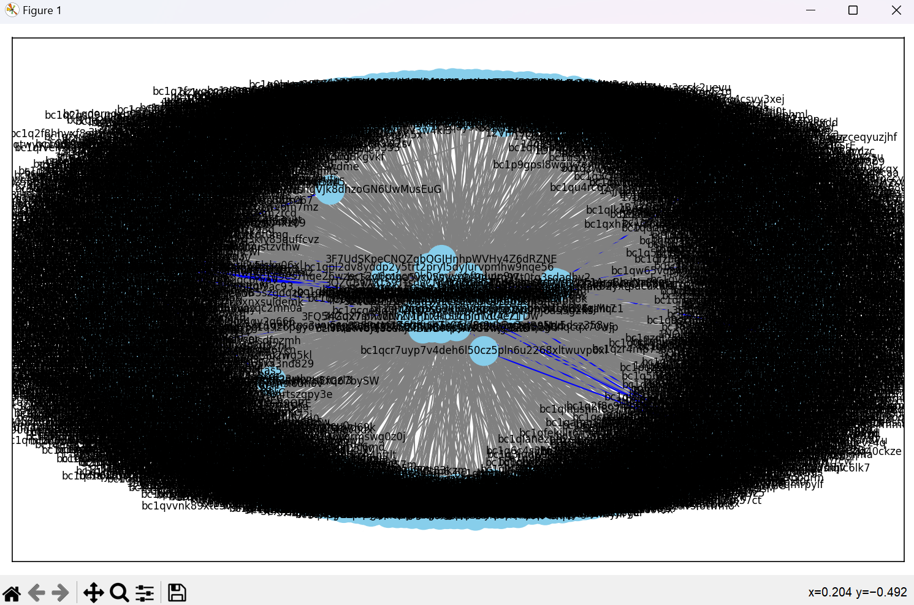
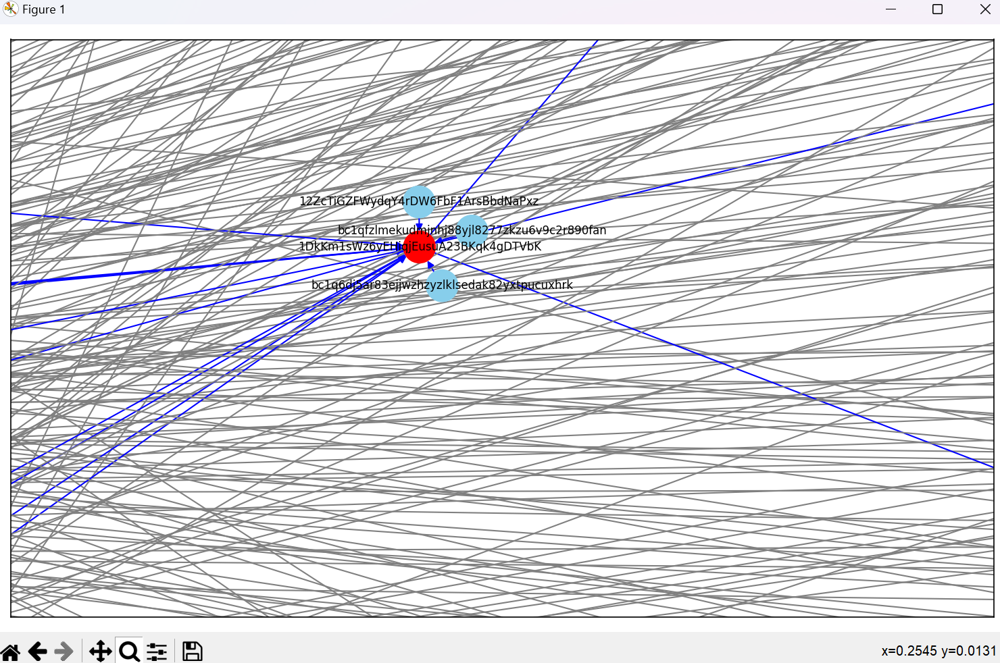

# Blockchain Forensics using Graph Temporal Logic 
     <br/>


## Visualization without UTC
### Code
```
import requests
import pandas as pd
import networkx as nx
import matplotlib.pyplot as plt
from datetime import datetime


def fetch_address_data(address):
    """
    Function to fetch address data.
    
    Parameters:
    - address: The Bitcoin address to fetch data for.
    """
    url = f"https://blockchain.info/address/{address}?format=json"
    response = requests.get(url)
    data = response.json()
    return data


def transform_data(data):
    """
    Function to transform address data.
    
    Parameters:
    - data: The address data to transform.
    """
    transactions = []
    for tx in data["txs"]:
        for out in tx["out"]:
            address_a = tx["inputs"][0]["prev_out"]["addr"]
            address_b = out["addr"]
            timestamp = datetime.fromtimestamp(tx["time"]).strftime("%m-%d-%Y %H:%M")
            transaction_id = tx["hash"]
            transaction = {
                "Address A": address_a,
                "Address B": address_b,
                "Timestamp": timestamp,
                "Transaction ID": transaction_id
            }
            transactions.append(transaction)
    return transactions


def export_to_excel(data, filename):
    """
    Function to export data to Excel.
    
    Parameters:
    - data: The data to export.
    - filename: The name of the Excel file to export to.
    """
    df = pd.DataFrame(data)
    df["Timestamp"] = pd.to_datetime(df["Timestamp"])  # Convert Timestamp column to datetime
    df["Timestamp"] = df["Timestamp"].dt.strftime("%m-%d-%Y %H:%M")  # Format Timestamp column
    df.to_excel(filename, index=False)
    print(f"Data exported to {filename}")


def create_and_visualize_graph(df, user_addresses):
    """
    Function to create graph and visualize it.
    
    Parameters:
    - df: The DataFrame containing the transaction data.
    - user_addresses: The list of user addresses.
    """
    graph = nx.DiGraph()  # Create a networkx graph

    for address in df['Address A'].unique():
        if address in user_addresses:
            graph.add_node(address, color='red')  # Highlight user address nodes in red
        else:
            graph.add_node(address, color='skyblue')

    for _, row in df.iterrows():
        source = str(row['Address A'])
        target = str(row['Address B'])
        timestamp_str = str(row['Timestamp'])
        transaction_hash = str(row['Transaction ID'])

        if source in user_addresses or target in user_addresses:
            graph.add_edge(source, target, color='blue')  # Highlight edges connected to user address in blue
        else:
            graph.add_edge(source, target, color='gray')

    plt.figure(figsize=(10, 6))  # Draw the graph using matplotlib
    pos = nx.spring_layout(graph)
    node_colors = [graph.nodes[node].get('color', 'skyblue') for node in graph.nodes]
    edge_colors = [graph.edges[edge]['color'] for edge in graph.edges]

    nx.draw_networkx(graph, pos, with_labels=True, node_size=500, font_size=8, node_color=node_colors, edge_color=edge_colors)

    plt.tight_layout()  # Show the graph
    plt.show()


def main():
    """
    Main program.
    """
    user_addresses = []
    for i in range(4):
        address = input(f"Enter address {i+1} of 4: ")
        user_addresses.append(address)

    all_transformed_data = []

    for address in user_addresses:
        address_data = fetch_address_data(address)
        transformed_data = transform_data(address_data)
        all_transformed_data.extend(transformed_data)

    export_to_excel(all_transformed_data, "Data.xlsx")
    df = pd.read_excel('Data.xlsx')

    create_and_visualize_graph(df, user_addresses)


if __name__ == "__main__":
    main()
```

### Output
<p align="center">

</p>

<p align="center">

</p>

### Source
<p align="center">

</p>

<p align="center">

</p>

<p align="center">

</p>

<p align="center">

</p>

